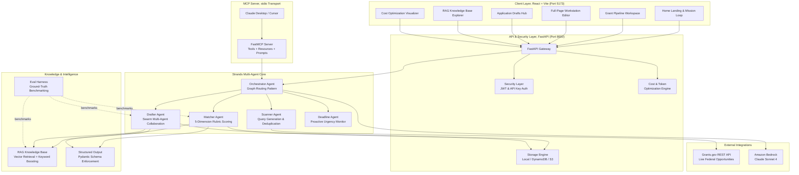

# 🛰️ GrantScout

> **An autonomous AI agent that finds federal grants for small nonprofits, scores how well they fit, and pre-writes the application, so your team can focus on the mission, not the paperwork.**

---

## The Problem

Every year, **billions of dollars** in federal grant funding go unclaimed. Not because worthy nonprofits don't exist, but because small, community-rooted 501(c)(3) organizations don't have dedicated grant-writing staff. They can't afford to monitor Grants.gov daily, wade through hundreds of pages of eligibility criteria, or write 20-page narrative proposals for every opportunity that *might* be a fit.

The result? The organizations closest to the communities that need help the most are the least likely to get funded.

## What GrantScout Does

**GrantScout** is a multi-agent AI system built with the **[Strands Agents SDK](https://github.com/strands-agents/sdk-python)** and **Amazon Bedrock**. It runs autonomously in the background on a configurable schedule (default: every 24 hours), scanning for new federal grants, scoring them, and drafting applications — only surfacing when there's a real decision to make. GrantScout:

1. **Scans** the live [Grants.gov REST API](https://api.grants.gov/) for real federal funding opportunities that match the nonprofit's mission keywords.
2. **Scores** every discovered grant against the organization's profile using a 5-dimension, 100-point rubric (Mission Alignment, Eligibility Fit, Capacity Match, Geographic Fit, Track Record), with Pydantic-enforced structured outputs so scores are always consistent and auditable.
3. **Routes** grants autonomously: high-fit opportunities (≥80) trigger automatic application drafting; medium-fit (50–79) are flagged for human review; low-fit (<50) are archived silently.
4. **Drafts** competitive 6-section federal grant applications grounded in the nonprofit's own history (past proposals, IRS 990 filings, and impact reports), retrieved via a built-in RAG knowledge base.
5. **Surfaces** only when a real decision is needed: a high-confidence match found, or a draft ready for final human review.

## Who It's For

Small and mid-size nonprofits, such as after-school programs, community health clinics, and youth mentorship organizations, that run on tight budgets. A standard 20-page federal grant proposal takes 40+ hours and costs **$5,000 to $15,000** to outsource to a professional grant writer. GrantScout autonomously generates a highly-competitive 6-section draft for approximately **$0.15** in AWS Bedrock inference costs—a **99.9% cost reduction**, giving small organizations the same competitive advantage that large institutions get from full-time development teams.

## How It Uses Strands Agents

GrantScout runs **5 specialized Strands Agents**, each with its own system prompt, tools, and responsibility:

| Agent | Strands Pattern | What It Does |
|:---|:---|:---|
| **Scanner** | Workflow | Queries Grants.gov with mission-derived keywords, deduplicates, fetches full opportunity details |
| **Matcher** | Structured Output | Scores grants on a 100-point rubric using `structured_output` with Pydantic schema enforcement |
| **Orchestrator** | Graph | Routes grants based on score thresholds: auto-draft, flag for review, or archive silently |
| **Drafter** | Swarm | Generates structured 6-section grant applications with narrative, budget, and compliance sections |
| **Deadline** | Scheduler | Sweeps pipeline deadlines and broadcasts urgency-tiered alerts |

All agents use `@tool`-decorated functions, Amazon Bedrock (Claude Sonnet / Haiku), and the Strands `Agent()` class. The system also includes a **FastMCP server** for integration with Claude Desktop and Cursor, and a **RAG knowledge base** using Amazon Titan Embeddings for vector retrieval over organizational documents.

---

## 🏛️ System Architecture



---

## 🤖 Strands SDK Multi-Agent Patterns

GrantScout implements multi-agent patterns using the **Strands Agents SDK**:

| Agent | Pattern | Role & Behavior |
|---|---|---|
| **Orchestrator Agent** | **Graph Routing** | Autonomously routes opportunities based on fit scores: ≥80 auto-triggers application drafting, 50–79 flags for human review, <50 archives silently. |
| **Drafter Swarm** | **Swarm Pattern** | Coordinates specialized sub-agents (`NarrativeAgent`, `BudgetAgent`, `ComplianceDrafterAgent`, `LeadDrafterAgent`) with autonomous handoffs to generate structured 6-section applications. |
| **Scanner Agent** | **Workflow** | Queries public Grants.gov endpoints (`search2`, `fetchOpportunity`) using org mission keywords and eliminates duplicates via Fast-tier LLM inference. |
| **Matcher Agent** | **Rubric Scoring** | Quantifies 5 dimensions on a 100-point scale: Mission Alignment (30), Eligibility Fit (25), Capacity Match (20), Geography (15), Track Record (10). |
| **Deadline Agent** | **Monitoring** | Tracks impending closing windows and broadcasts urgency-tiered alerts to the activity stream. |

---

## ✨ Key Technical Features

### 🎨 Editorial Brutalist Web Dashboard & Workstation
A custom frontend built in **React + Vite** adhering to the **Field Ops / Editorial Brutalist** design system:
- **Typography**: Google Fonts `Bebas Neue` (condensed uppercase headers), `Plus Jakarta Sans` (body), and `JetBrains Mono` (telemetry/metadata)
- **Palette**: Warm ivory canvas (`#FAF8F5`), solid `#18181B` borders with sharp 4px offset box shadows (`4px 4px 0px #18181B`), and mission olive green / amber signal accents
- **Multi-Tenant Persona Selector & Onboard Wizard**: Seamlessly switch between pre-built nonprofit archetypes (STEM Education, Food Security, Clean Water, Veterans Health) or onboard custom Form 990 filings.
- **Real-Time Agent Thought Stream**: Collapsible telemetry tray displaying live agent decisions, model tiers invoked, and tool executions via SSE stream. The Drafting UI features a sequential swarm feed with dynamic loaders and visual tick marks for completed sub-agent tasks.
- **Multi-Page Routing (`react-router-dom`)**:
  - `/`, **Home Landing & Mission Overview**: Multi-agent loop banner, telemetry summary, and feature cards
  - `/pipeline`, **Grant Pipeline Workspace**: Scanned metrics, sector filters, and grant opportunity cards
  - `/grants/:id`, **Full-Page Workstation**: 5-dimension rubric breakdown, 6-section proposal editor, and Markdown exporter
  - `/drafts`, **Application Drafts Hub**: List of all pre-filled applications
  - `/knowledge`, **RAG Knowledge Base**: Interactive vector search query tester over organizational documents
  - `/optimization`, **Cost Optimization**: Model configuration, cache stats, and token telemetry

### ⚖️ Federal 2 CFR 200 Regulatory Compliance Engine
Automated pre-submission regulatory compliance auditing for federal grant proposals:
- **Indirect Cost Rate Audit**: Validates against the 10% de minimis Modified Total Direct Cost (MTDC) allowance under 2 CFR 200.414(f).
- **Unallowable Cost Detection**: Scans for prohibited federal expenditures (Alcohol §200.423, Entertainment §200.438, Lobbying §200.450, Fundraising §200.442, Contingencies §200.433).
- **Personnel Standards Verification**: Checks direct staff effort allocations and fringe benefit formulations (§200.430).
- **Interactive Audit Badge**: Renders compliance score (0–100), rule-by-rule findings, and remedial action items on the proposal workstation.

### 📐 Structured Output Enforcement
All agent outputs are validated against **Pydantic schemas** using the Strands SDK `structured_output` API:
- `GrantEvaluationResult`, enforces typed 5-dimension scoring, status enum, and action routing
- `ApplicationDraftResult`, enforces 6-section structure with word counts and completion tracking
- `ComplianceAuditResult`, enforces statutory compliance findings and risk levels
- Computed fields (`MatchScore.total`) ensure scoring consistency

### 📚 RAG Knowledge Base
Vector-based retrieval over indexed nonprofit organizational documents:
- **Document Types**: Annual Reports, IRS 990, Past Proposals, Staff Bios
- **Hybrid Search**: Cosine similarity (70%) + keyword lexical boosting (30%)
- **Paragraph Chunking**: Splits documents into semantically meaningful paragraphs for retrieval precision
- **REST API**: `POST /api/documents/search` for direct knowledge base search

### 🔌 MCP Server (Model Context Protocol)
Full-featured MCP server for integration with Claude Desktop, Cursor, and other MCP-compatible tools:
- **Tools**: `search_federal_grants`, `fetch_grant_opportunity`, `query_organization_knowledge_base`, `evaluate_grant_fit`, `draft_grant_section`
- **Resources**: `grantscout://profile`, `grantscout://pipeline`, `grantscout://knowledge-base/documents`
- **Prompt Templates**: `analyze_grant_opportunity`, `draft_grant_proposal`
- **Transport**: stdio (local integration)

### 🧪 Evaluation Harness
Empirical benchmarking suite for agent accuracy measurement:
- **5 ground-truth test cases** spanning strong matches, partial matches, and clear mismatches
- **Matcher scoring precision**: 100% (5/5 passed)
- **RAG retrieval precision**: 100% (4/4 organizational facts correctly retrieved)
- **Drafter completeness**: 100% (6 complete sections generated)
- Run with: `python tests/eval_harness.py`

### 💰 Cost & Token Optimization (Multi-Model Tiering)
Dynamic multi-model routing and caching to minimize inference costs:

- **Fast Tier (Claude Haiku)**: High-frequency scanning, keyword extraction, and deadline arithmetic
- **Standard Tier (Claude Sonnet)**: 5-dimension rubric evaluation and graph routing
- **Premium Tier (Claude Sonnet)**: Multi-section proposal drafting and compliance auditing
- **LRU Response Cache**: 256-entry cache with 1-hour TTL for deterministic tool outputs
- **Token Usage Tracker**: Per-agent usage logging with cost estimation
- **Prompt Compression**: Strips boilerplate phrases and truncates long synopses to reduce token consumption
- **Resilient Long-Running Inference**: Extended AWS Bedrock connection timeouts (3600s) and Boto3 retry strategies configured globally to support the Drafter Swarm generating massive 8,000+ token structured outputs without interruption.

### 🔒 Security & Token Validation
- **Cryptographic JWT Tokens**: Signed via `PyJWT (HS256)` with configurable expiry and scope claims (`read`, `write`, `agent:execute`)
- **Dual Authentication**: `Authorization: Bearer <token>` and `X-API-Key` headers
- **Prompt Injection Defense**: Pre-flight input sanitizer neutralizes adversarial prompt overrides
- **Security Headers**: `X-Content-Type-Options`, `X-Frame-Options`, `X-XSS-Protection`, `Strict-Transport-Security`

---

## 📂 Project Structure

```
grantscout/
├── backend/
│   ├── agents/              # Strands Agent definitions
│   │   ├── scanner.py       #   Grants.gov discovery agent (Workflow pattern)
│   │   ├── matcher.py       #   5-dimension scoring agent (Graph router)
│   │   ├── drafter.py       #   Application drafting agent (Swarm pattern)
│   │   ├── deadline.py      #   Deadline monitoring agent
│   │   └── orchestrator.py  #   Graph-based multi-agent orchestrator
│   ├── api/
│   │   └── models/
│   │       └── schemas.py   #   Pydantic schemas (structured outputs)
│   ├── mcp/
│   │   └── server.py        #   FastMCP server (tools, resources, prompts)
│   ├── optimization/
│   │   └── __init__.py      #   Tiered routing, LRU cache, token tracker
│   ├── rag/
│   │   └── knowledge_base.py # Vector retrieval engine (Titan Embeddings V2)
│   ├── security/
│   │   └── auth.py          #   JWT & API key authentication
│   ├── storage/
│   │   └── local_storage.py #   Local JSON-file storage fallback
│   ├── tools/               # Strands @tool functions
│   │   ├── grants_api.py    #   Grants.gov REST API client
│   │   ├── org_profile.py   #   Organizational profile retrieval
│   │   ├── application.py   #   Application draft persistence
│   │   └── rag_search.py    #   RAG knowledge base tool
│   ├── config.py            # Environment configuration
│   └── main.py              # FastAPI application entry point
├── frontend/                # React + Vite Client Application (Port 5173)
│   ├── src/
│   │   ├── components/      # UI components (Header, MetricsBar, GrantCard, MissionLoopBanner, etc.)
│   │   ├── context/         # GrantContext (global state provider)
│   │   ├── pages/           # HomePage, PipelinePage, GrantDetailPage, DraftsPage, KnowledgeBasePage, OptimizationPage
│   │   ├── App.jsx          # React Router v6 navigation
│   │   ├── index.css        # Field Ops / Editorial Brutalist design system
│   │   └── main.jsx         # React application entry point
│   ├── index.html           # HTML template with Google Fonts (Bebas Neue, Plus Jakarta Sans)
│   ├── package.json         # Frontend dependencies & scripts
│   └── vite.config.js       # Vite configuration
├── tests/
│   ├── eval_harness.py      # Ground-truth evaluation benchmarks
│   ├── test_security.py     # Security & auth tests (8 tests)
│   ├── test_pipeline.py     # Multi-agent pipeline tests (5 tests)
│   ├── test_structured_output.py  # Structured output tests (3 tests)
│   ├── test_rag.py          # RAG retrieval tests (5 tests)
│   ├── test_mcp_server.py   # MCP server tests (8 tests)
│   └── test_optimization.py # Optimization & eval tests (21 tests)
├── scripts/
│   ├── seed_org_profile.py  # Seed nonprofit profile
│   ├── seed_knowledge_base.py # Seed RAG knowledge base documents
│   └── test_grants_api.py   # Live Grants.gov API probe
├── data/                    # Local storage & RAG documents
├── run_mcp_server.py        # MCP server entry point
├── pyproject.toml           # Python project configuration
├── .env.example             # Environment variable template
└── .env                     # Local environment settings
```

---

## 🚀 Quickstart Guide

### 1. Prerequisites
- Python 3.10+
- Node.js 18+ & npm
- An AWS account with Bedrock access (optional, deterministic fallback works offline)

### 2. Clone & Setup Backend
```bash
git clone https://github.com/GitSuman0699/grantscout.git
cd grantscout

# Create and activate virtual environment
python -m venv .venv
# On Windows:
.venv\Scripts\activate
# On macOS/Linux:
source .venv/bin/activate

# Install backend dependencies
pip install -e .
```

### 3. Configure Environment Variables
Copy `.env.example` to `.env` and fill in your settings:
```bash
cp .env.example .env
```

Key environment variables:
| Variable | Default | Description |
|---|---|---|
| `AWS_REGION` | `us-east-1` | AWS region for Bedrock |
| `BEDROCK_MODEL_ID` | `us.anthropic.claude-sonnet-4-5-20250929-v1:0` | Standard/Premium Bedrock model for orchestrator & drafter |
| `BEDROCK_FAST_MODEL_ID` | `us.anthropic.claude-haiku-4-5-20251001-v1:0` | Fast tier Bedrock model for scan query generation |
| `BEDROCK_PREMIUM_MODEL_ID` | `us.anthropic.claude-sonnet-4-5-20250929-v1:0` | Premium tier Bedrock model for structured drafting |
| `USE_LOCAL_STORAGE` | `true` | Use local JSON files vs DynamoDB/S3 |
| `AUTH_ENABLED` | `true` | Enable JWT/API key authentication |
| `SECRET_KEY` | (default) | JWT signing key |
| `MASTER_API_KEY` | (default) | API key for service auth |
| `AUTO_SCAN_ENABLED` | `true` | Enable background autonomous scanning |
| `SCAN_INTERVAL_HOURS` | `24` | Hours between background scan cycles (Grants.gov updates daily) |

### 4. Initialize Profile & Start Backend
```bash
# Seed initial nonprofit profile
python scripts/seed_org_profile.py

# Start FastAPI server
python -m uvicorn backend.main:app --host 0.0.0.0 --port 8000 --reload
```
- API Base URL: `http://localhost:8000`
- Interactive OpenAPI Docs: `http://localhost:8000/docs`

### 5. Start Frontend Web Dashboard
In a new terminal:
```bash
cd frontend
npm install
npm run dev
```
- Web Application: **`http://localhost:5173`**

### 6. Start the MCP Server (Optional)
For Claude Desktop / Cursor integration:
```bash
python run_mcp_server.py
```

---

## 🧪 Testing & Verification

Run the full automated test suite (**50 Python tests + Frontend build**):

```bash
# Run all backend tests at once (50/50 tests passing)
python -m unittest discover tests/ -v

# Or run individual suites:
python tests/test_security.py         # Security & Auth (8 tests)
python tests/test_pipeline.py         # Multi-Agent Pipeline (5 tests)
python tests/test_structured_output.py  # Structured Outputs (3 tests)
python tests/test_rag.py              # RAG Retrieval (5 tests)
python tests/test_mcp_server.py       # MCP Server (8 tests)
python tests/test_optimization.py     # Optimization & Eval (21 tests)

# Run evaluation harness benchmarks
python tests/eval_harness.py

# Build frontend production bundle
cd frontend && npm run build
```

### Evaluation Harness Results

| Test Case | Grant | Expected Score | Actual Score | Action | Result |
|-----------|-------|---------------|-------------|--------|--------|
| eval-001 | Youth STEM Innovation Labs (NSF) | 78-100 | **94** | auto_draft | ✅ |
| eval-002 | Agricultural Water Conservation (USDA) | 0-35 | **28** | archive_silently | ✅ |
| eval-003 | Community Digital Literacy (DOL) | 50-79 | **57** | manual_review | ✅ |
| eval-004 | After-School Coding Academies (DoEd) | 80-100 | **94** | auto_draft | ✅ |
| eval-005 | Defense Quantum Computing (DARPA) | 0-20 | **14** | archive_silently | ✅ |

---

## 📡 API Reference

### Core Endpoints

| Method | Endpoint | Auth | Description |
|--------|----------|------|-------------|
| `GET` | `/health` | No | Service health check |
| `POST` | `/api/auth/token` | API Key | Exchange API Key for Bearer JWT token |
| `GET` | `/api/auth/verify` | Yes | Verify token claims & validity |

### Dashboard & Streaming

| Method | Endpoint | Auth | Description |
|--------|----------|------|-------------|
| `GET` | `/api/dashboard/stats` | No | Summary dashboard metrics |
| `GET` | `/api/dashboard/activity` | No | Agent decision timeline |
| `GET` | `/api/dashboard/stream` | No | Server-Sent Events (SSE) notification stream |

### Grant Pipeline

| Method | Endpoint | Auth | Description |
|--------|----------|------|-------------|
| `GET` | `/api/grants` | No | List pipeline grant opportunities |
| `GET` | `/api/grants/{id}` | No | Get grant with 5-dimension rubric score |
| `POST` | `/api/grants/{id}/draft` | Yes | Trigger autonomous application drafting |

### Application Drafts

| Method | Endpoint | Auth | Description |
|--------|----------|------|-------------|
| `GET` | `/api/applications` | No | List generated application drafts |
| `GET` | `/api/applications/{id}` | No | Get multi-section application draft |
| `PUT` | `/api/applications/{id}` | Yes | Edit/update application sections |

### Organization Profile

| Method | Endpoint | Auth | Description |
|--------|----------|------|-------------|
| `GET` | `/api/org/profile` | No | Get active nonprofit profile |
| `POST` | `/api/org/profile` | Yes | Create or update organization profile |

### Agent Actions

| Method | Endpoint | Auth | Description |
|--------|----------|------|-------------|
| `POST` | `/api/agent/scan` | Yes | Trigger federal grant discovery scan |
| `POST` | `/api/agent/orchestrate` | Yes | Trigger complete autonomous Graph cycle |
| `POST` | `/api/agent/deadlines` | Yes | Run deadline sweep across opportunities |

### RAG Knowledge Base

| Method | Endpoint | Auth | Description |
|--------|----------|------|-------------|
| `POST` | `/api/documents/search` | No | Semantic search over org knowledge base |
| `GET` | `/api/documents` | No | List indexed knowledge base documents |
| `POST` | `/api/documents/index` | Yes | Index a new document into the knowledge base |

### Cost & Token Optimization

| Method | Endpoint | Auth | Description |
|--------|----------|------|-------------|
| `GET` | `/api/optimization/token-usage` | No | Per-agent token usage & estimated costs |
| `GET` | `/api/optimization/cache-stats` | No | Cache hit rate, size, and TTL info |
| `GET` | `/api/optimization/model-tiers` | No | Full model routing configuration |

---

## 🏆 Hackathon Alignment

- **Technological Implementation**: Built with `strands-agents`, leveraging Graph, Swarm, and Workflow orchestration with native Amazon Bedrock support, structured outputs, RAG, FastMCP server, and comprehensive test coverage (50 backend tests + eval harness + production build). Designed for seamless Amazon Bedrock AgentCore runtime hosting with stateless tool interfaces and persistent storage adapters.
- **Potential Impact**: Directly targets the $1.5T federal grant ecosystem, leveling the playing field for small 501(c)(3) nonprofits that cannot afford dedicated grant-writing agencies.
- **Creativity & Autonomous Behavior**: GrantScout's multi-agent pipeline runs autonomously in the background on a configurable 24-hour schedule — scanning, scoring, routing, and drafting without any human trigger. It only surfaces when there's a real decision: a high-confidence match found or a draft ready for final review.
- **Cost Efficiency**: A single 20-page federal grant proposal typically costs a nonprofit $5,000 to $15,000 to outsource. GrantScout generates a 6-section, 4,500+ word draft for **~$0.15** in AWS Bedrock tokens. Additionally, response caching eliminates redundant inference, and configurable model tier definitions allow future multi-model routing to optimize AWS credit usage.

---

## 📄 License

This project is licensed under the [MIT License](LICENSE).
