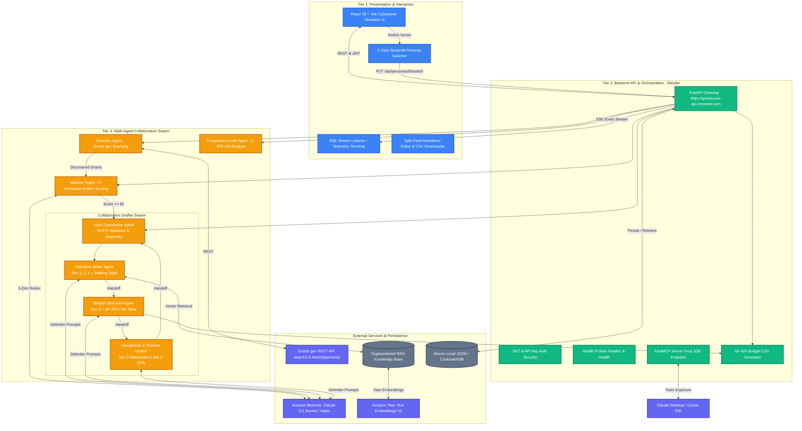

# 🛰️ GrantScout

**Autonomous Multi-Agent Federal Grant Intelligence & Drafting Platform for Nonprofits**

[](https://python.org)
[](https://fastapi.tiangolo.com)
[](https://reactjs.org)
[](https://vitejs.dev)
[](https://aws.amazon.com/bedrock/)
[](https://modelcontextprotocol.io)
[](https://grantscout-api.onrender.com/healthz)

Built for the **Agents for Humans Hackathon**, GrantScout automates the end-to-end federal grant lifecycle for resource-constrained small nonprofits. It continuously monitors federal databases, scores opportunities against an organization's mission and past performance using a strict 5-dimension rubric, and autonomously drafts complete, audit-ready 6-section grant proposals with downloadable SF-424 federal budget spreadsheets.

---

## ⚡ Brutally Honest Implementation Truths

We believe in transparency. Here is the honest breakdown of how GrantScout works under the hood—what is 100% authentic, what was re-engineered for resilience, and architectural decisions made:

| Component | The Honest Reality |
|---|---|
| **Zero Mock / Fallback Data** | **100% Real**. GrantScout enforces a strict zero-mock policy across the entire platform. Opportunities come directly from the federal **Grants.gov REST API**. Proposal narratives, budgets, and compliance checks are synthesized in real-time by **Amazon Bedrock (Claude 3.5 Sonnet & Haiku)**. If Bedrock or Grants.gov encounters an error, it fails loudly and transparently with an actionable error message rather than silently injecting fake data. |
| **Proposal Output Protocol** | **Permanently Delimiter-Based (`<<<SECTION_...>>>`)**. Earlier monolithic versions attempted to force LLMs to output 6 long-form Markdown sections (with markdown tables, quotes, and numbered subsections) wrapped inside a single JSON string. In production, this repeatedly crashed with `JSONDecodeError: Unterminated string` due to literal raw newlines, unescaped quotes (`"2 CFR 200"`), and token truncation. We solved this by implementing **Tag-Delimited Markdown Extraction** (`<<<SECTION_1_EXECUTIVE_SUMMARY>>>`, etc.) with multi-pattern regex parsers and single-section full-text fallbacks. The LLM generates pure native Markdown without any JSON serialization bottlenecks. |
| **Multi-Agent Collaborative Swarm** | **Authentic Collaborative Swarm**. Proposals are not generated via a single prompt. A 4-agent collaborative swarm divides the workload: `NarrativeWriterAgent` handles Sections 1, 2, and 4; `BudgetSpecialistAgent` handles Section 5 and triggers the SF-424 CSV generator; `ComplianceDrafterAgent` handles Section 3 (12-month milestone table) and Section 6 (KPI matrix); and `LeadCoordinatorAgent` validates NOFO compliance and commits the draft. |
| **SF-424 Budget & CSV Generation** | **Fully Functional 2 CFR 200 Tooling**. The Budget Specialist runs `generate_budget_csv()` to itemize direct personnel (55%), fringe benefits (22%), materials/supplies (12%), travel (5%), other direct costs, and a 10% MTDC De Minimis indirect rate. The output is persisted to disk and instantly downloadable via the UI or REST endpoint (`/api/applications/draft/{grant_id}/budget.csv`). |
| **24/7 Background Scanner** | **On-Demand Execution by Default**. The code for the continuous 24-hour autonomous background scheduler loop exists in `backend/main.py`. However, it is set to manual/on-demand trigger by default in production to protect AWS Bedrock API credits and stay within hackathon quotas. |
| **Database & Persistence** | **Atomic Local JSON & Cloud-Ready**. Storage defaults to atomic, thread-locked local JSON records (`backend/storage/local_storage.py`), which provides rock-solid durability without external database configuration overhead, while maintaining full compatibility with CockroachDB / relational persistence. |
| **Cloud Deployment** | **Live on Render**. The backend API is hosted at `https://grantscout-api.onrender.com` with cloud health monitoring (`/healthz`, `/health`, `/api/health`), ASGI security headers, and SSE streaming telemetry. |

---

## 🏗️ 3-Tier System Architecture



---

## 🤖 Agent Roles & Swarm Patterns

| Agent | Architecture Pattern | Responsibility & Implementation |
|---|---|---|
| **Scanner Agent** | **Workflow / Tool-Use** | Queries live Grants.gov REST API (`search2` & `fetchOpportunity`) using mission keywords, extracting funding ceilings, deadlines, eligibility codes, and agency synopsis. |
| **Matcher Agent** | **Rubric Evaluator** | Scores grants against applicant profile across 5 distinct dimensions (Mission Alignment 30%, Eligibility Fit 25%, Capacity Match 20%, Geographic Fit 15%, Track Record 10%). Generates detailed fit rationales. |
| **Narrative Writer** | **Collaborative Swarm** | Retrieves RAG grounding passages from organizational archives via Titan Embeddings and drafts **Section 1 (Executive Summary)**, **Section 2 (Statement of Need)**, and **Section 4 (Key Personnel & Staffing Table)**. |
| **Budget Specialist** | **Deterministic & Tool-Use** | Calculates 2 CFR 200 Uniform Guidance allocations (Personnel 55%, Fringe 22%, Supplies 12%, Travel 5%, 10% MTDC Indirect), runs `generate_budget_csv()`, and authors **Section 5 (Budget Justification)** with SF-424 cost table. |
| **Compliance Drafter** | **Collaborative Swarm** | Drafts **Section 3 (Project Design & 12-Month Phased Milestone Table)** and **Section 6 (Evaluation Metrics & SMART KPI Table)**. |
| **Lead Coordinator** | **Orchestrator** | Validates 6-section proposal completeness against federal NOFO guidelines, compiles the final proposal, and persists the draft. |
| **Compliance Auditor** | **Inspector** | Audits generated proposals against 2 CFR 200 regulations, checking for mandatory federal clauses, MTDC indirect cost compliance, and past-performance qualifications. |

---

## 📊 SF-424 Federal Budget CSV Tooling

Every federal grant drafted by GrantScout includes an automated, mathematically sound SF-424 budget aligned with **2 CFR 200 Uniform Guidance**:

1. **Direct Personnel (55%)**: Base salaries allocated to Project Director, Lead Coordinator, and field staff.
2. **Fringe Benefits (22% of Personnel)**: FICA, health insurance, worker's compensation, and retirement contributions.
3. **Supplies & Materials (12%)**: Educational equipment, digital hardware, and participant supplies.
4. **Programmatic Travel (5%)**: Community site visits, participant transport, and mandatory grantee workshops.
5. **Other Direct Costs**: Contractual services, software licenses, evaluation stipends.
6. **Indirect Costs (10% MTDC De Minimis Rate)**: Calculated in strict compliance with 2 CFR 200.414(f).

The generated budget is exportable directly from the proposal dashboard as a standardized federal CSV:
```http
GET /api/applications/draft/{grant_id}/budget.csv
```

---

## 🏢 Multi-Tenant Nonprofit Personas

GrantScout supports instant multi-tenant persona switching. Nonprofits can switch their sectoral focus with 1 click, instantly re-indexing RAG knowledge bases and recalibrating grant match rubrics:

| Persona ID | Organization Name | Focus Area & Keywords | Annual Budget |
|---|---|---|---|
| `youth-stem` | **Youth Education Alliance** | STEM education, robotics, workforce development, underserved youth | $450,000 |
| `food-security` | **Second Harvest Community Network** | Food security, food banking, nutrition assistance, supply logistics | $850,000 |
| `clean-water` | **Clearwater Watershed Coalition** | Clean drinking water, environmental conservation, watershed protection | $320,000 |
| `veterans-health` | **Veterans First Support Services** | Veteran healthcare, mental health, transition assistance, PTSD support | $600,000 |

Switch personas instantly via API:
```bash
curl -X POST https://grantscout-api.onrender.com/api/personas/youth-stem/switch \
     -H "Authorization: Bearer <TOKEN>"
```

---

## 🔌 Model Context Protocol (MCP) Integration

GrantScout implements an MCP server mounted directly at `/mcp` on the FastAPI service, allowing external AI clients (like Claude Desktop, Cursor, and Antigravity) to call GrantScout tools directly over SSE:

- `search_grants`: Search federal opportunities with keyword and funding filters.
- `score_grant`: Score an opportunity against the active organization profile.
- `draft_proposal`: Synthesize 6-section proposals using the Bedrock Swarm.
- `audit_compliance`: Run 2 CFR 200 compliance audits on existing applications.
- `list_personas`: Retrieve available nonprofit sector profiles.

Run the standalone MCP server locally:
```bash
python run_mcp_server.py
```

---

## 📡 Live API Endpoints

The API is deployed and monitored live on Render:
- **Base URL**: `https://grantscout-api.onrender.com`

| Method | Endpoint | Description |
|---|---|---|
| `GET` | `/healthz`, `/health`, `/api/health` | Active health check probes returning service status and timestamp. |
| `GET` | `/api/dashboard/stats` | Dashboard statistics (active opportunities, drafted proposals, pipeline value). |
| `GET` | `/api/dashboard/stream` | Server-Sent Events (SSE) telemetry feed for real-time agent thoughts. |
| `POST` | `/api/orchestrator/scan` | Trigger the Scanner and Matcher agents against live Grants.gov. |
| `GET` | `/api/grants` | List all discovered, scored, and routed grant opportunities. |
| `GET` | `/api/grants/{id}` | Retrieve specific grant metadata and 5-dimension rubric breakdown. |
| `POST` | `/api/grants/{id}/draft` | Trigger the 4-Agent Collaborative Swarm to draft a 6-section proposal. |
| `GET` | `/api/applications/draft/{grant_id}` | Retrieve the synthesized proposal sections and completion status. |
| `GET` | `/api/applications/draft/{grant_id}/budget.csv` | Download the SF-424 federal budget spreadsheet CSV. |
| `GET` | `/api/applications/draft/{grant_id}/compliance` | Run autonomous 2 CFR 200 compliance audit on the proposal. |
| `GET` | `/api/personas` | List all available nonprofit sector profiles. |
| `POST` | `/api/personas/{id}/switch` | Switch active organization persona and recalculate grounding. |
| `POST` | `/api/auth/token` | Exchange master API key for signed JWT access token. |
| `ALL` | `/mcp` | FastMCP Server SSE endpoint for AI tool calling. |

---

## 🧪 Testing & Empirical Evaluation

GrantScout includes a rigorous test suite of **54 unit and integration tests**:

```bash
# Run the entire test suite
pytest tests/ -v
```

### Test Coverage Breakdown:
- `tests/test_compliance.py`: Verifies 2 CFR 200 Uniform Guidance compliance scoring and flag generation.
- `tests/test_mcp_server.py`: Validates FastMCP tool registration, schemas, and SSE handlers.
- `tests/test_optimization.py`: Tests tiered model routing, token estimation, response caching, and prompt compression.
- `tests/test_personas.py`: Tests multi-tenant persona catalog, profile conversion, and sectoral switching.
- `tests/test_pipeline.py`: Tests live Grants.gov API connectivity, storage persistence, and deadline scanning.
- `tests/test_rag.py`: Tests Titan Text Embeddings V2 vector indexing, cosine similarity retrieval, and category filtering.
- `tests/test_security.py`: Tests JWT authentication, API key enforcement, and ASGI security headers.
- `tests/test_structured_output.py`: Validates Pydantic schema enforcement and structured JSON/delimiter output parsing.
- `tests/eval_harness.py`: Evaluates Matcher scoring precision and Drafter completeness against 5 ground-truth federal grant test cases.

---

## 🚀 Quickstart Guide

### Prerequisites
- **Python 3.11+**
- **Node.js 18+ & npm**
- **AWS Account** with Bedrock model access (`anthropic.claude-3-5-sonnet-20241022-v2:0` / `amazon.titan-embed-text-v2:0`)

### 1. Clone & Configure Environment
```bash
git clone -b 3-tier-architecture https://github.com/GitSuman0699/grantscout.git
cd grantscout

# Copy environment template
cp .env.example .env
```

Ensure your `.env` contains:
```env
AWS_REGION=us-east-1
AWS_ACCESS_KEY_ID=your_aws_access_key
AWS_SECRET_ACCESS_KEY=your_aws_secret_key
BEDROCK_FAST_MODEL_ID=anthropic.claude-3-haiku-20240307-v1:0
BEDROCK_STANDARD_MODEL_ID=anthropic.claude-3-5-sonnet-20241022-v2:0
TITAN_EMBEDDING_MODEL_ID=amazon.titan-embed-text-v2:0
MASTER_API_KEY=gs_live_8f7e6d5c4b3a210987654321
SECRET_KEY=grantscout-sec-key-6f8b9e4a3d2c1b0a9f8e7d6c5b4a3210
USE_LOCAL_STORAGE=true
```

### 2. Backend Setup & Startup
```bash
# Create and activate virtual environment
python -m venv .venv
source .venv/bin/activate  # On Windows: .venv\Scripts\activate

# Install dependencies
pip install -e .

# Seed initial organization profile
python scripts/seed_org_profile.py

# Start FastAPI server
uvicorn backend.main:app --host 0.0.0.0 --port 8000 --reload
```
API runs locally at `http://localhost:8000` with interactive docs at `http://localhost:8000/docs`.

### 3. Frontend Setup & Startup
```bash
cd frontend
npm install

# Start Vite development server
npm run dev
```
Open `http://localhost:5173` in your browser.

---

## 👥 Authors & Acknowledgments

Developed by **GitSuman0699** for the **Agents for Humans Hackathon**.
Special thanks to the teams behind **Amazon Bedrock**, **Strands Agents SDK**, and the **Model Context Protocol** for making agentic intelligence accessible to mission-driven nonprofits.