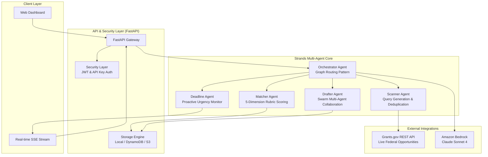

# 🛰️ GrantScout

> **Autonomous AI Grant Discovery & Application Agent for Nonprofits**  
> *Built with the Strands Agents SDK for the AWS "Agents for Humans" Hackathon*

---

## 🌟 Overview

Every year, billions of dollars in federal grant funding go unallocated simply because small, community-rooted nonprofits lack the dedicated grant-writing staff to discover opportunities, parse hundreds of pages of eligibility criteria, and write boilerplate narrative proposals.

**GrantScout** solves this by running silently in the background as an autonomous multi-agent system. Instead of another dashboard users have to babysit, GrantScout:
1. **Discovers** federal grant opportunities from live Grants.gov REST endpoints matching the nonprofit's mission.
2. **Evaluates** organizational fit against a 5-dimension, 100-point rubric.
3. **Pre-fills** comprehensive 6-section application drafts using verified organizational facts and past track records.
4. **Surfaces** only when high-confidence matches are found or when an application draft is ready for final human review.

---

## 🏛️ System Architecture



---

## 🤖 Strands SDK Multi-Agent Patterns

GrantScout implements all three core multi-agent patterns available in the **Strands Agents SDK**:

| Agent | Multi-Agent Pattern | Role & Behavior |
|---|---|---|
| **Orchestrator Agent** | **Graph Pattern** | Autonomously routes opportunities based on fit scores: $\ge 80\%$ auto-triggers application drafting; $50\text{--}79\%$ flags for human review; $< 50\%$ archives silently. |
| **Drafter Agent** | **Swarm Pattern** | Coordinates specialized sub-agents (*Narrative Writer*, *Budget Specialist*, *Compliance Checker*) with autonomous handoffs to generate structured 6-section applications. |
| **Scanner Agent** | **Workflow Pattern** | Queries public Grants.gov endpoints (`search2`, `fetchOpportunity`) using org mission keywords and eliminates duplicates. |
| **Matcher Agent** | **Rubric Scoring Engine** | Quantifies 5 dimensions on a 100-point scale: Mission Alignment (30), Eligibility Fit (25), Capacity Match (20), Geography (15), Track Record (10). |
| **Deadline Agent** | **Scheduler Pattern** | Tracks impending closing windows and broadcasts urgency-tiered alerts to the real-time activity stream. |

---

## 🔒 Security & Token Validation

- **Cryptographic JWT Tokens**: Signed access tokens via `PyJWT (HS256)` with configurable expiry and granular scope claims (`read`, `write`, `agent:execute`).
- **Dual Authentication Support**: Supports both `Authorization: Bearer <token>` and `X-API-Key` headers for client and service-to-service automation.
- **Prompt Injection Defense**: Pre-flight input sanitizer (`sanitize_input`) neutralizes adversarial prompt overrides before model consumption.
- **Security Headers**: Injects `X-Content-Type-Options: nosniff`, `X-Frame-Options: DENY`, `X-XSS-Protection`, and `Strict-Transport-Security`.

---

## 🚀 Quickstart Guide

### 1. Prerequisites
- Python 3.10+ installed
- Node.js 18+ (for frontend tooling)

### 2. Clone & Setup Environment
```bash
cd grantscout

# Create and activate virtual environment
python -m venv .venv
# On Windows:
.venv\Scripts\activate
# On macOS/Linux:
source .venv/bin/activate

# Install dependencies
pip install -e .
```

### 3. Configure Environment Variables
Copy `.env.example` to `.env` and fill in your settings:
```bash
cp .env.example .env
```

### 4. Seed Demo Organization Profile & Grants
```bash
python scripts/seed_org_profile.py
python scripts/seed_sample_grants.py
```

### 5. Start the FastAPI Server
```bash
python -m uvicorn backend.main:app --host 0.0.0.0 --port 8000 --reload
```
- API Base URL: `http://localhost:8000`
- Interactive OpenAPI Docs: `http://localhost:8000/docs`

---

## 🧪 Testing & Verification

Run the automated test suites:

```bash
# Run Security & Auth Test Suite (8 tests)
python tests/test_security.py

# Run Multi-Agent Pipeline Test Suite (5 tests)
python tests/test_pipeline.py
```

---

## 📡 API Reference

| Method | Endpoint | Auth Required | Description |
|---|---|---|---|
| `GET` | `/health` | No | Service health check |
| `POST` | `/api/auth/token` | No (requires API Key) | Exchange API Key for Bearer JWT token |
| `GET` | `/api/auth/verify` | Yes | Verify token claims & validity |
| `GET` | `/api/dashboard/stats` | No | Summary dashboard metrics |
| `GET` | `/api/dashboard/activity` | No | Real-time agent decision timeline |
| `GET` | `/api/dashboard/stream` | No | Server-Sent Events (SSE) notification stream |
| `GET` | `/api/grants` | No | List pipeline grant opportunities |
| `GET` | `/api/grants/{id}` | No | Get single grant with 5-dimension rubric score |
| `POST` | `/api/grants/{id}/draft` | Yes | Trigger autonomous application drafting |
| `GET` | `/api/applications` | No | List generated application drafts |
| `GET` | `/api/applications/{id}` | No | Get multi-section application draft |
| `PUT` | `/api/applications/{id}` | Yes | Edit/update application sections |
| `GET` | `/api/org/profile` | No | Get active nonprofit profile |
| `POST` | `/api/org/profile` | Yes | Create or update organization profile |
| `POST` | `/api/agent/scan` | Yes | Manually trigger federal grant discovery scan |
| `POST` | `/api/agent/orchestrate` | Yes | Trigger complete autonomous Graph cycle |
| `POST` | `/api/agent/deadlines` | Yes | Run deadline sweep across active opportunities |

---

## 🏆 Hackathon Alignment

- **Technological Implementation**: Built with `strands-agents 1.52.0`, leveraging Graph, Swarm, and Workflow orchestration with native Amazon Bedrock support and comprehensive unit/integration test coverage.
- **Potential Impact**: Directly targets the $1.5T federal grant ecosystem, leveling the playing field for small 501(c)(3) nonprofits that cannot afford dedicated grant-writing agencies.
- **Creativity & Autonomous Behavior**: Unlike passive dashboards that demand continuous manual searching, GrantScout works in the background and only surfaces when real human review is required.

---

## 📄 License

This project is licensed under the [MIT License](LICENSE).
