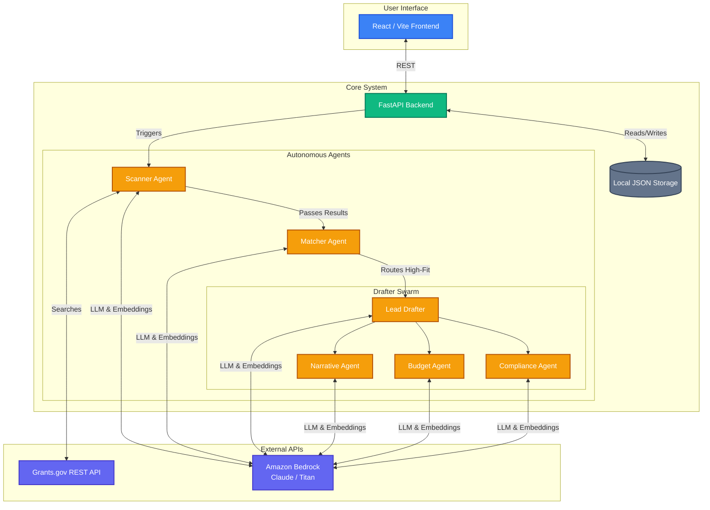

# 🛰️ GrantScout

**AI-powered grant discovery and drafting agent for nonprofits.**

Built for the Agents for Humans Hackathon, GrantScout is a multi-agent system built with the **Strands Agents SDK** and **Amazon Bedrock**. It scans federal databases, scores matches against an organizational profile, and drafts 6-section applications using a multi-agent Swarm.

---

## ⚙️ How It Works (The Facts)

1. **Scans**: Queries the live **Grants.gov REST API** using mission-derived keywords.
2. **Scores**: Evaluates discovered grants against the organization's profile using a strict 5-dimension, 100-point rubric (Mission Alignment, Eligibility Fit, Capacity Match, Geographic Fit, Track Record).
3. **Routes**: Uses a deterministic Graph execution: high-fit (≥80) trigger auto-drafting; medium-fit (50–79) flag for review; low-fit (<50) archive silently.
4. **Drafts**: Uses a **4-agent Swarm** (Narrative, Budget, Compliance, Lead Drafter) to generate a structured 6-section grant application.
5. **RAG**: Grounds the narrative using a Knowledge Base that indexes uploaded organizational documents via **Amazon Titan Text Embeddings V2**.

### 🏗️ Architecture Diagram



## 🛠️ Brutally Honest Implementation Details

While the project has many advanced features, here is the honest reality of the implementation:

- **"24/7 Background Scanning" is Disabled**: The code for the 24-hour autonomous background scheduler exists in `backend/main.py`, but it is intentionally commented out to prevent unexpected AWS Bedrock usage costs. Scans must be triggered manually via the dashboard.
- **Database**: The architecture mentions DynamoDB/S3, but the actual implementation relies entirely on `backend/storage/local_storage.py`, which simply dumps JSON files to the local disk. It works well for a hackathon, but it is not a production database.
- **Grants.gov Integration**: It genuinely queries the live, public Grants.gov REST API (`search2` and `fetchOpportunity` endpoints).
- **True Multi-Agent Swarm**: The drafting process is not just a single prompt. `drafter.py` implements a real Strands SDK `Swarm` where 4 specialized sub-agents autonomously hand off tasks to each other using the `handoff_to_agent` tool.
- **Structured Outputs**: All agent decisions (scoring, compliance auditing, draft sections) are strictly enforced using Pydantic schemas via the Strands SDK `structured_output` API.

---

## 🤖 Strands SDK Multi-Agent Patterns

| Agent | Pattern | Role |
|---|---|---|
| **Orchestrator Agent** | **Graph Routing** | Routes opportunities based on fit scores. |
| **Drafter Swarm** | **Swarm Pattern** | Coordinates `NarrativeAgent`, `BudgetAgent`, `ComplianceDrafterAgent`, and `LeadDrafterAgent` to generate applications. |
| **Scanner Agent** | **Workflow** | Queries public Grants.gov endpoints. |
| **Matcher Agent** | **Rubric Scoring** | Quantifies 5 dimensions on a 100-point scale. |
| **Deadline Agent** | **Monitoring** | Tracks closing windows. |

---

## 🏛️ Tech Stack

- **Frontend**: React + Vite, `react-router-dom`, custom Brutalist UI.
- **Backend**: Python FastAPI with Server-Sent Events (SSE) for real-time agent telemetry.
- **Agents**: Strands Agents SDK + Amazon Bedrock (Claude 4.5 Sonnet & Haiku).
- **RAG**: Custom vector retrieval using Amazon Titan Embeddings V2 and cosine similarity.
- **MCP**: FastMCP server included for Claude Desktop / Cursor integration.

---

## 🧪 Testing & Evaluation

The repository includes a comprehensive testing suite:
- **Unit Tests**: 50 Python tests covering security, pipelines, structured outputs, RAG, and MCP.
- **Evaluation Harness (`tests/eval_harness.py`)**: An empirical benchmarking script that tests the Matcher and Drafter agents against 5 ground-truth federal grant test cases, verifying scoring precision, routing accuracy, and RAG retrieval.

---

## 💻 Local Setup

### 1. Prerequisites
- Python 3.10+
- Node.js 18+ & npm
- AWS Credentials (for Bedrock and Titan Embeddings)

### 2. Backend Setup
```bash
python -m venv .venv
source .venv/bin/activate  # Or .venv\Scripts\activate on Windows
pip install -e .
cp .env.example .env
```

### 3. Initialize & Run Backend
```bash
python scripts/seed_org_profile.py
python -m uvicorn backend.main:app --host 0.0.0.0 --port 8000 --reload
```
API Base URL: `http://localhost:8000`

### 4. Run Frontend
```bash
cd frontend
npm install
npm run dev
```
Web Application: `http://localhost:5173`

### 5. Run MCP Server (Optional)
```bash
python run_mcp_server.py
```