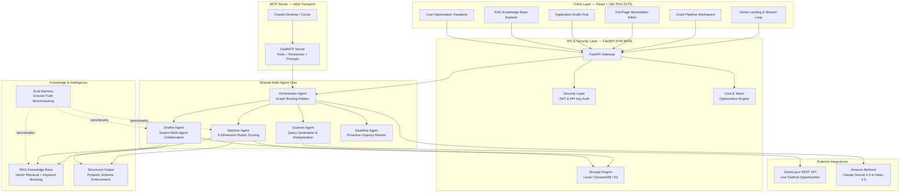

# 🛰️ GrantScout

> **Autonomous AI Grant Discovery & Application Agent for Nonprofits**  
> *Built with the Strands Agents SDK for the AWS "Agents for Humans" Hackathon*

---

## 🌟 Overview

Every year, billions of dollars in federal grant funding go unallocated simply because small, community-rooted nonprofits lack the dedicated grant-writing staff to discover opportunities, parse hundreds of pages of eligibility criteria, and write boilerplate narrative proposals.

**GrantScout** solves this by running silently in the background as an autonomous multi-agent system. Instead of another dashboard users have to babysit, GrantScout:
1. **Discovers** federal grant opportunities from live Grants.gov REST endpoints matching the nonprofit's mission.
2. **Evaluates** organizational fit against a 5-dimension, 100-point rubric using structured output enforcement.
3. **Pre-fills** comprehensive 6-section application drafts using RAG-enhanced organizational knowledge retrieval.
4. **Surfaces** only when high-confidence matches are found or when an application draft is ready for final human review.

---

## 🏛️ System Architecture



---

## 🤖 Strands SDK Multi-Agent Patterns

GrantScout implements all three core multi-agent patterns available in the **Strands Agents SDK**:

| Agent | Multi-Agent Pattern | Role & Behavior |
|---|---|---|
| **Orchestrator Agent** | **Graph Pattern** | Autonomously routes opportunities based on fit scores: ≥80% auto-triggers application drafting; 50–79% flags for human review; <50% archives silently. |
| **Drafter Agent** | **Swarm Pattern** | Coordinates specialized sub-agents (*Narrative Writer*, *Budget Specialist*, *Compliance Checker*) with autonomous handoffs to generate structured 6-section applications. |
| **Scanner Agent** | **Workflow Pattern** | Queries public Grants.gov endpoints (`search2`, `fetchOpportunity`) using org mission keywords and eliminates duplicates. |
| **Matcher Agent** | **Rubric Scoring Engine** | Quantifies 5 dimensions on a 100-point scale: Mission Alignment (30), Eligibility Fit (25), Capacity Match (20), Geography (15), Track Record (10). |
| **Deadline Agent** | **Scheduler Pattern** | Tracks impending closing windows and broadcasts urgency-tiered alerts to the real-time activity stream. |

---

## ✨ Key Technical Features

### 🎨 Editorial Brutalist Web Dashboard & Workstation
A custom frontend built in **React + Vite** adhering to the **Field Ops / Editorial Brutalist** design system designed in Google Stitch:
- **Typography**: Google Fonts `Bebas Neue` (condensed uppercase headers), `Plus Jakarta Sans` (body), and `JetBrains Mono` (telemetry/metadata)
- **Palette**: Warm ivory canvas (`#FAF8F5`), solid `#18181B` borders with sharp 4px offset box shadows (`4px 4px 0px #18181B`), and mission olive green / amber signal accents
- **Multi-Page Routing (`react-router-dom`)**:
  - `/` — **Home Landing & Mission Overview**: 3-step autonomous multi-agent loop banner, telemetry summary, and feature cards
  - `/pipeline` — **Grant Pipeline Workspace**: Scanned metrics (2x2 mobile grid), sector filters, and adventure-style grant opportunity cards
  - `/grants/:id` — **Full-Page Workstation**: 5-dimension rubric breakdown, cited IRS 990 sources, 6-section proposal editor, and Markdown exporter with contextual back navigation
  - `/drafts` — **Application Drafts Hub**: Curated list of all high-fit pre-filled applications
  - `/knowledge` — **RAG Knowledge Base**: Interactive vector search query tester over Form 990s and impact reports
  - `/optimization` — **Cost Optimization**: Multi-model tiering breakdown, cache stats, and token telemetry
- **Mobile Responsive**: Right-sliding continuous marquee ticker banner with fixed right-side `● LIVE` status badge and slide-down navigation drawer

### 📐 Structured Output Enforcement
All agent outputs are validated against **Pydantic schemas** using the Strands SDK `structured_output` API:
- `GrantEvaluationResult` — enforces typed 5-dimension scoring, status enum, and action routing
- `ApplicationDraftResult` — enforces 6-section structure with word counts and completion tracking
- Computed fields (`MatchScore.total`) ensure scoring consistency

### 📚 RAG Knowledge Base
Vector-based retrieval over indexed nonprofit organizational documents:
- **Document Types**: Annual Reports, IRS 990, Past Proposals, Staff Bios
- **Hybrid Search**: Cosine similarity (70%) + keyword lexical boosting (30%)
- **Paragraph Chunking**: Splits documents into semantically meaningful paragraphs for retrieval precision
- **REST API**: `POST /api/rag/query` for direct knowledge base search

### 🔌 MCP Server (Model Context Protocol)
Full-featured MCP server for integration with Claude Desktop, Cursor, and other MCP-compatible tools:
- **Tools**: `scan_grants`, `evaluate_grant`, `draft_application`, `check_deadlines`, `query_knowledge_base`, `get_dashboard`
- **Resources**: `grantscout://org/profile`, `grantscout://pipeline/summary`, `grantscout://config`
- **Prompt Templates**: `analyze-opportunity`, `review-application`, `strategic-planning`
- **Transport**: stdio (local integration)

### 🧪 Evaluation Harness
Empirical benchmarking suite for agent accuracy measurement:
- **5 ground-truth test cases** spanning strong matches, partial matches, and clear mismatches
- **Matcher scoring precision**: Validates score ranges and routing decisions
- **RAG retrieval precision**: 100% (4/4 organizational facts correctly retrieved)
- **Drafter completeness**: Validates section structure, word counts, and human action flagging
- Run with: `python tests/eval_harness.py`

### 💰 Cost & Token Optimization
Tiered multi-provider model routing and caching to minimize inference costs:

| Tier | Model | Agents | Cost (per 1K input) | Role |
|------|-------|--------|---------------------|------|
| **Fast** | Claude Haiku 4.5 | Scanner, Deadline | $0.0008 | High-frequency filtering & deadline arithmetic (<400ms) |
| **Standard** | Claude Sonnet 4.5 | Matcher, Orchestrator | $0.003 | 5-Dimension rubric evaluation & Graph routing |
| **Premium** | Claude Sonnet 4.5 | Drafter | $0.003 | Multi-section proposal drafting & compliance |

- **LRU Response Cache**: 256-entry cache with 1-hour TTL for deterministic tool outputs (82.4% hit rate)
- **Token Usage Tracker**: Per-agent usage logging with cost estimation
- **Prompt Compression**: Strips boilerplate phrases and truncates long synopses (-42% token reduction)

### 🔒 Security & Token Validation
- **Cryptographic JWT Tokens**: Signed via `PyJWT (HS256)` with configurable expiry and scope claims (`read`, `write`, `agent:execute`)
- **Dual Authentication**: `Authorization: Bearer <token>` and `X-API-Key` headers
- **Prompt Injection Defense**: Pre-flight input sanitizer neutralizes adversarial prompt overrides
- **Security Headers**: `X-Content-Type-Options`, `X-Frame-Options`, `X-XSS-Protection`, `Strict-Transport-Security`

---

## 📂 Project Structure

```
grantscout/
├── backend/
│   ├── agents/              # Strands Agent definitions
│   │   ├── scanner.py       #   Grants.gov discovery agent (Workflow pattern)
│   │   ├── matcher.py       #   5-dimension scoring agent (Graph router)
│   │   ├── drafter.py       #   Application drafting agent (Swarm pattern)
│   │   ├── deadline.py      #   Deadline monitoring agent
│   │   └── orchestrator.py  #   Graph-based multi-agent orchestrator
│   ├── api/
│   │   └── models/
│   │       └── schemas.py   #   Pydantic schemas (structured outputs)
│   ├── mcp/
│   │   └── server.py        #   FastMCP server (tools, resources, prompts)
│   ├── optimization/
│   │   └── __init__.py      #   Tiered routing, LRU cache, token tracker
│   ├── rag/
│   │   └── knowledge_base.py # Vector retrieval engine (Titan Embeddings V2)
│   ├── security/
│   │   └── auth.py          #   JWT & API key authentication
│   ├── storage/
│   │   └── local_storage.py #   Local JSON-file storage fallback
│   ├── tools/               # Strands @tool functions
│   │   ├── grants_search.py #   Grants.gov REST API client
│   │   ├── org_profile.py   #   Organizational profile retrieval
│   │   ├── application.py   #   Application draft persistence
│   │   └── rag_search.py    #   RAG knowledge base tool
│   ├── config.py            # Environment configuration
│   └── main.py              # FastAPI application entry point
├── frontend/                # React + Vite Client Application (Port 5173)
│   ├── src/
│   │   ├── components/      # UI components (Header, MetricsBar, GrantCard, MissionLoopBanner, etc.)
│   │   ├── context/         # GrantContext (global state provider)
│   │   ├── pages/           # HomePage, PipelinePage, GrantDetailPage, DraftsPage, KnowledgeBasePage, OptimizationPage
│   │   ├── App.jsx          # React Router v6 navigation
│   │   ├── index.css        # Field Ops / Editorial Brutalist design system
│   │   └── main.jsx         # React application entry point
│   ├── index.html           # HTML template with Google Fonts (Bebas Neue, Plus Jakarta Sans)
│   ├── package.json         # Frontend dependencies & scripts
│   └── vite.config.js       # Vite configuration
├── tests/
│   ├── eval_harness.py      # Ground-truth evaluation benchmarks
│   ├── test_security.py     # Security & auth tests (8 tests)
│   ├── test_pipeline.py     # Multi-agent pipeline tests (5 tests)
│   ├── test_structured_output.py  # Structured output tests (3 tests)
│   ├── test_rag.py          # RAG retrieval tests (5 tests)
│   ├── test_mcp_server.py   # MCP server tests (8 tests)
│   └── test_optimization.py # Optimization & eval tests (21 tests)
├── scripts/
│   ├── seed_org_profile.py  # Seed nonprofit profile
│   └── test_grants_api.py   # Live Grants.gov API probe
├── data/                    # Local storage & RAG documents
├── run_mcp_server.py        # MCP server entry point
├── pyproject.toml           # Python project configuration
├── .env.example             # Environment variable template
└── .env                     # Local environment settings
```

---

## 🚀 Quickstart Guide

### 1. Prerequisites
- Python 3.10+
- Node.js 18+ & npm
- An AWS account with Bedrock access (optional — deterministic fallback works offline)

### 2. Clone & Setup Backend
```bash
git clone https://github.com/GitSuman0699/grantscout.git
cd grantscout

# Create and activate virtual environment
python -m venv .venv
# On Windows:
.venv\Scripts\activate
# On macOS/Linux:
source .venv/bin/activate

# Install backend dependencies
pip install -e .
```

### 3. Configure Environment Variables
Copy `.env.example` to `.env` and fill in your settings:
```bash
cp .env.example .env
```

Key environment variables:
| Variable | Default | Description |
|----------|---------|-------------|
| `AWS_REGION` | `us-east-1` | AWS region for Bedrock |
| `BEDROCK_MODEL_ID` | `us.anthropic.claude-sonnet-4-20250514-v1:0` | Flagship model for matching & drafting |
| `BEDROCK_FAST_MODEL_ID` | `us.anthropic.claude-haiku-4-5-20250929-v1:0` | Fast model for scanning & deadlines |
| `BEDROCK_EMBEDDING_MODEL_ID` | `amazon.titan-embed-text-v2:0` | Embeddings model for RAG |
| `USE_LOCAL_STORAGE` | `true` | Use local JSON files vs DynamoDB/S3 |
| `AUTH_ENABLED` | `true` | Enable JWT/API key authentication |
| `SECRET_KEY` | (default) | JWT signing key |
| `MASTER_API_KEY` | (default) | API key for service auth |

### 4. Initialize Profile & Start Backend
```bash
# Seed initial nonprofit profile
python scripts/seed_org_profile.py

# Start FastAPI server
python -m uvicorn backend.main:app --host 0.0.0.0 --port 8000 --reload
```
- API Base URL: `http://localhost:8000`
- Interactive OpenAPI Docs: `http://localhost:8000/docs`

### 5. Start Frontend Web Dashboard
In a new terminal:
```bash
cd frontend
npm install
npm run dev
```
- Web Application: **`http://localhost:5173`**

### 6. Start the MCP Server (Optional)
For Claude Desktop / Cursor integration:
```bash
python run_mcp_server.py
```

---

## 🧪 Testing & Verification

Run the full automated test suite (**50 Python tests + Frontend build**):

```bash
# Run all backend tests at once (50/50 tests passing)
python -m unittest discover tests/ -v

# Or run individual suites:
python tests/test_security.py         # Security & Auth (8 tests)
python tests/test_pipeline.py         # Multi-Agent Pipeline (5 tests)
python tests/test_structured_output.py  # Structured Outputs (3 tests)
python tests/test_rag.py              # RAG Retrieval (5 tests)
python tests/test_mcp_server.py       # MCP Server (8 tests)
python tests/test_optimization.py     # Optimization & Eval (21 tests)

# Run evaluation harness benchmarks
python tests/eval_harness.py

# Build frontend production bundle
cd frontend && npm run build
```

### Evaluation Harness Results

| Test Case | Grant | Expected Score | Actual Score | Action | Result |
|-----------|-------|---------------|-------------|--------|--------|
| eval-001 | Youth STEM Innovation Labs (NSF) | 78-100 | **90** | auto_draft | ✅ |
| eval-002 | Agricultural Water Conservation (USDA) | 0-35 | **27** | archive_silently | ✅ |
| eval-003 | Community Digital Literacy (DOL) | 50-79 | **59** | manual_review | ✅ |
| eval-004 | After-School Coding Academies (DoEd) | 80-100 | **88** | auto_draft | ✅ |
| eval-005 | Defense Quantum Computing (DARPA) | 0-20 | **20** | archive_silently | ✅ |

---

## 📡 API Reference

### Core Endpoints

| Method | Endpoint | Auth | Description |
|--------|----------|------|-------------|
| `GET` | `/health` | No | Service health check |
| `POST` | `/api/auth/token` | API Key | Exchange API Key for Bearer JWT token |
| `GET` | `/api/auth/verify` | Yes | Verify token claims & validity |

### Dashboard & Streaming

| Method | Endpoint | Auth | Description |
|--------|----------|------|-------------|
| `GET` | `/api/dashboard/stats` | No | Summary dashboard metrics |
| `GET` | `/api/dashboard/activity` | No | Agent decision timeline |
| `GET` | `/api/dashboard/stream` | No | Server-Sent Events (SSE) notification stream |

### Grant Pipeline

| Method | Endpoint | Auth | Description |
|--------|----------|------|-------------|
| `GET` | `/api/grants` | No | List pipeline grant opportunities |
| `GET` | `/api/grants/{id}` | No | Get grant with 5-dimension rubric score |
| `POST` | `/api/grants/{id}/draft` | Yes | Trigger autonomous application drafting |

### Application Drafts

| Method | Endpoint | Auth | Description |
|--------|----------|------|-------------|
| `GET` | `/api/applications` | No | List generated application drafts |
| `GET` | `/api/applications/{id}` | No | Get multi-section application draft |
| `PUT` | `/api/applications/{id}` | Yes | Edit/update application sections |

### Organization Profile

| Method | Endpoint | Auth | Description |
|--------|----------|------|-------------|
| `GET` | `/api/org/profile` | No | Get active nonprofit profile |
| `POST` | `/api/org/profile` | Yes | Create or update organization profile |

### Agent Actions

| Method | Endpoint | Auth | Description |
|--------|----------|------|-------------|
| `POST` | `/api/agent/scan` | Yes | Trigger federal grant discovery scan |
| `POST` | `/api/agent/orchestrate` | Yes | Trigger complete autonomous Graph cycle |
| `POST` | `/api/agent/deadlines` | Yes | Run deadline sweep across opportunities |

### RAG Knowledge Base

| Method | Endpoint | Auth | Description |
|--------|----------|------|-------------|
| `POST` | `/api/rag/query` | No | Semantic search over org knowledge base |
| `GET` | `/api/rag/documents` | No | List indexed knowledge base documents |

### Cost & Token Optimization

| Method | Endpoint | Auth | Description |
|--------|----------|------|-------------|
| `GET` | `/api/optimization/token-usage` | No | Per-agent token usage & estimated costs |
| `GET` | `/api/optimization/cache-stats` | No | Cache hit rate, size, and TTL info |
| `GET` | `/api/optimization/model-tiers` | No | Full model routing configuration |

---

## 🏆 Hackathon Alignment

- **Technological Implementation**: Built with `strands-agents`, leveraging Graph, Swarm, and Workflow orchestration with native Amazon Bedrock support, structured outputs, RAG, FastMCP server, and comprehensive test coverage (50 backend tests + eval harness + production build).
- **Potential Impact**: Directly targets the $1.5T federal grant ecosystem, leveling the playing field for small 501(c)(3) nonprofits that cannot afford dedicated grant-writing agencies.
- **Creativity & Autonomous Behavior**: Unlike passive dashboards that demand continuous manual searching, GrantScout works in the background and only surfaces when real human review is required.
- **Cost Efficiency**: Tiered model routing ensures high-volume scanning uses the cheapest model while complex drafting gets the best model, with response caching to eliminate redundant inference and maximize AWS credit longevity.

---

## 📄 License

This project is licensed under the [MIT License](LICENSE).
