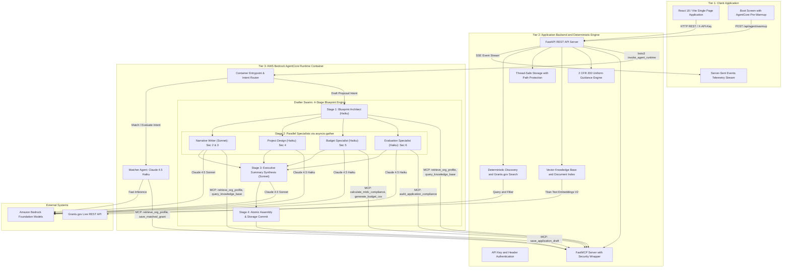

# GrantScout

Autonomous Multi-Agent Federal Grant Intelligence and Proposal Generation System

GrantScout is a decoupled, multi-agent platform designed to automate the federal grant lifecycle for nonprofit organizations. It handles live opportunity discovery from federal databases, multi-dimensional rubric qualification, organizational retrieval-augmented generation (RAG), automated multi-section proposal authoring, Uniform Guidance compliance auditing (2 CFR 200), and deadline tracking.

The system is built on a 3-tier decoupled architecture separating deterministic application logic from cognitive reasoning engines deployed on AWS Bedrock AgentCore.

---

## 1. System Architecture

The architecture enforces strict separation of concerns across three tiers:



### Tier 1: Presentation Layer
* **Technology:** React 18, Vite, Vanilla CSS design tokens.
* **Capabilities:**
  * Mission Radar dashboard with grant metrics and recent activities.
  * Real-time Server-Sent Events (SSE) execution feed displaying agent reasoning.
  * Kanban qualification pipeline categorized by discovery and review states.
  * 5-dimension rubric fit analysis visualizer with radar charts and criteria breakdown.
  * Full 6-section proposal draft editor with live Markdown preview and export tools.
  * Interactive RAG document manager for Form 990 filings, impact reports, and staff biographies.
  * Cost and token optimization dashboard tracking cache hit rates and model tier distribution.
  * Unified brutalist boot screen that triggers background container warmup.

### Tier 2: Application Backend and Deterministic Engine
* **Technology:** FastAPI, Pydantic V2, Python 3.12, SQLite / JSON thread-safe local storage.
* **Capabilities:**
  * Deterministic ingestion loop fetching active Grants.gov opportunities without LLM token waste.
  * FastMCP tool server running over Server-Sent Events (SSE) at `/mcp`, protected by explicit API key authentication.
  * Atomic, lock-guarded file-based persistence hardened against path traversal attacks (`_safe_identifier`).
  * In-memory cosine similarity RAG pipeline with Amazon Titan Text Embeddings V2 (`amazon.titan-embed-text-v2:0`).
  * 2 CFR 200 Uniform Guidance audit engine validating indirect cost caps, de minimis rates, and allowability rules.
  * Asynchronous container pre-warmup endpoint (`POST /api/agent/warmup`) ensuring zero cold-start friction.

### Tier 3: Decoupled Reasoning Engine (AWS Bedrock AgentCore)
* **Technology:** AWS Bedrock AgentCore (Containerized Runtime), Strands SDK, Anthropic Claude 4.5 Sonnet, Anthropic Claude 4.5 Haiku.
* **Architecture:**
  * Runs as a decoupled Docker container on Amazon Bedrock AgentCore infrastructure with an automated 15-minute (`900s`) scale-to-zero timeout policy.
  * Connects over the network to the Tier 2 FastMCP server to discover and execute domain tools securely across environment boundaries.
  * **Intent Router (`agentcore/src/main.py`)**: Directs incoming requests to specialized agents based on task context:
    * **Matcher Agent (`agentcore/src/agents/matcher.py`)**: Uses **Claude 4.5 Haiku** (`us.anthropic.claude-haiku-4-5-20251001-v1:0`) for low-latency rubric qualification across 5 dimensions:
      1. Mission Alignment (30 pts)
      2. Eligibility Check (25 pts)
      3. Organizational Capacity (20 pts)
      4. Geographic Scope (15 pts)
      5. Past Performance (10 pts)
    * **Drafter Swarm (`agentcore/src/agents/drafter.py`)**: Uses **Claude 4.5 Sonnet** (`us.anthropic.claude-sonnet-4-5-20250929-v1:0`) to synthesize complete, audit-grade proposals across all standard federal sections:
      1. Executive Summary
      2. Statement of Need
      3. Project Design and Methodology
      4. Work Plan, Key Milestones, and Staffing (FTE allocations)
      5. Evaluation and Performance Measurement Framework
      6. Budget Justification and Cost Breakdown
  * FastMCP Model Context Protocol server exposing 15 production tools and resources.
  * JWT access token management, scoped API key validation, and CORS whitelisting.

* **Capabilities:**
  * Scale-to-zero serverless container deployment with a 15-minute idle timeout.
  * Matcher Agent evaluating grant solicitations against 5 strategic dimensions.
  * Multi-agent proposal authoring swarm executing a 4-stage blueprint generation workflow with 4 parallel specialist agents via `asyncio.gather()`.
  * Automated generation of SF-424 compliant itemized budget tables in CSV format.

---

## 2. Core Features and Implementations

### Deterministic Discovery Engine
Located in `backend/discovery.py`, the discovery engine avoids using large language models for deterministic tasks, saving compute costs and eliminating graph latency.
* **Query Expansion:** Expands organization mission terms into synonyms and Assistance Listings (CFDA numbers) to query the Grants.gov `/v1/api/search2` endpoint.
* **Pre-Filtering:** Automatically filters out non-grant notices, Requests for Information (RFIs), closed opportunities, and grants closing in under 7 days.
* **Multi-Key Deduplication:** Merges incoming solicitations using numeric Grants.gov IDs, federal opportunity numbers, and normalized title slugs.

### Cognitive Rubric Matcher
Located in `agentcore/src/agents/matcher.py`, the Matcher Agent evaluates candidate grants against the organization profile using Claude 4.5 Haiku:
* **Evaluation Dimensions:**
  1. Mission Alignment (Target population and programmatic fit)
  2. Eligibility Fit (Applicant type, 501(c)(3) status, cost-sharing requirements)
  3. Organizational Capacity (Staffing scale, operational timeline, budget scale)
  4. Geographic Target (Service delivery jurisdiction)
  5. Past Performance (Track record in comparable federal awards)
* **Output Format:** Structured Pydantic schema with numeric scores (0 to 100), overall weighted score, eligibility flags, strengths, risks, and a recommendation status (`QUALIFIED_APPLY`, `FLAGGED_REVIEW`, or `NOT_RECOMMENDED`).

### Collaborative Proposal Drafter Swarm
Located in `agentcore/src/agents/drafter.py`, the proposal drafting engine utilizes a 4-stage blueprint architecture with **parallel specialist execution** to generate complete 6-section proposals in under 40 seconds:
* **Stage 1 — Blueprint Architect (~4s):** A fast Claude 4.5 Haiku agent synthesizes solicitation criteria, RAG knowledge base facts, and organization profile into a structured `ProjectBlueprint` Pydantic model — the single source of truth establishing budget amounts, staff FTE allocations, quarterly milestones, and SMART KPIs.
* **Stage 2 — Parallel Specialist Writers (~25s):** Four specialized `strands.Agent` instances execute **concurrently via `asyncio.gather()`**, each running in its own threadpool executor:
  * **Narrative Writer** (Claude 4.5 Sonnet): Sections 2 (Organizational Capacity) and 3 (Statement of Need)
  * **Project Design Specialist** (Claude 4.5 Haiku): Section 4 (Work Plan and Implementation Timeline)
  * **Budget Specialist** (Claude 4.5 Haiku): Section 5 (Budget Justification and SF-424 CSV generation)
  * **Evaluation Specialist** (Claude 4.5 Haiku): Section 6 (Evaluation and Sustainability) plus Federal Submission Checklist
* **Stage 3 — Executive Summary Synthesis (~6s):** A Claude 4.5 Sonnet agent reads all finalized Sections 2–6 and synthesizes Section 1 (Executive Summary) with accurate budget figures and project scope.
* **Stage 4 — Atomic Assembly (~1s):** All 6 canonical sections are validated, compiled, and committed atomically to persistent storage with 100% section completion.

### RAG Knowledge Base
Located in `backend/rag/knowledge_base.py`, the retrieval engine provides verifiable context from internal organization files:
* **Supported Documents:** IRS Form 990 filings, audited financials, past winning proposals, program evaluation reports, and staff biographies.
* **Hybrid Retrieval:** Calculates semantic similarity using Amazon Titan Text Embeddings V2 vectors alongside lexical keyword matching to score and rank relevant text passages.

### Uniform Guidance Compliance Engine
Located in `backend/tools/compliance.py`, the compliance module audits proposals against federal standards:
* **Standard Checked:** 2 CFR 200 (Uniform Guidance).
* **Indirect Cost Calculation:** Verifies compliance with the 15% Modified Total Direct Cost (MTDC) de minimis indirect rate.
* **Disallowed Cost Detection:** Scans narrative and line-item budgets for unallowable expenses including alcoholic beverages, entertainment, lobbying, and generalized fundraising costs.

### Model Context Protocol (MCP) Server
Located in `backend/mcp_endpoints/server.py`, the application exposes tools and data over the open MCP standard using Server-Sent Events (SSE):
* **Registered Tools:** 15 tools covering grants search, details retrieval, profile inspection, RAG querying, draft creation, section editing, budget generation, compliance auditing, and deadline alerts.
* **Resources:**
  * `grantscout://profile`: Active organization profile and mission data.
  * `grantscout://pipeline`: Full inventory of tracked opportunities and statuses.
  * `grantscout://knowledge-base/documents`: Indexed document metadata and word counts.
* **Security:** Mounted at `/mcp` behind `MCPAuthWrapper`, enforcing authentication before allowing tool execution.

### Cross-Tier MCP Tool Bridge
Located in `agentcore/src/mcp_tools.py`, this module is the client-side bridge that enables Tier 3 agents (running on AWS) to invoke domain tools hosted on the Tier 2 MCP Server (running on Render) across environment boundaries:
* **Architecture:** Each function is a thin `@tool`-decorated wrapper (compatible with Strands Agent SDK). Under the hood, it calls `_mcp_session.call_tool()` to forward the invocation over SSE to the Render MCP Server, which executes the real implementation against live storage and APIs.
* **Agent-to-Tool Mapping:**
  * **Blueprint Architect** (Stage 1): `retrieve_org_profile`, `query_knowledge_base`
  * **Narrative Writer** (Stage 2): `retrieve_org_profile`, `query_knowledge_base`
  * **Budget Specialist** (Stage 2): `calculate_mtdc_compliance`, `generate_budget_csv`
  * **Evaluation Specialist** (Stage 2): `audit_application_compliance`
  * **Atomic Commit** (Stage 4): `save_application_draft`
  * **Matcher Agent**: `retrieve_org_profile`, `save_matched_grant`, `query_knowledge_base`
* **Local Fallback:** When no MCP session is available (local development), the proxy automatically falls back to direct Python imports from `backend/tools/`, enabling the same agent code to run locally or in the cloud without modification.

### Security and Secret Isolation
The security subsystem implements enterprise-grade access control and defense-in-depth:
* **Secret Storage:** All secrets (`SECRET_KEY`, `MASTER_API_KEY`) are sourced strictly from environment variables. In production, missing credentials trigger an immediate startup failure. In local development, dynamic cryptographically secure ephemeral keys are generated.
* **API Authentication:** Supports signed JWT Bearer tokens (HS256) and master API key authentication (`X-API-Key`).
* **Path Traversal Defense:** Storage identifiers (`grant_id`, `org_id`, `draft_id`) are sanitized with `_safe_identifier()`, stripping directory traversal characters (`..`, `/`, `\`).
* **Prompt Injection Defense:** Input strings pass through `sanitize_input()`, neutralizing override signatures and control characters.
* **CORS Whitelist:** Replaces wildcards with explicit domain matching and origin regular expressions for local development and authorized cloud deployments.

### AgentCore Scale-to-Zero Container Warmup
Located in `backend/main.py` (`POST /api/agent/warmup`):
* The AWS Bedrock AgentCore container scales to zero when idle for 15 minutes.
* On initial frontend boot, `SplashScreen.jsx` dispatches a background warmup ping to `/api/agent/warmup`.
* The backend invokes `invoke_agent_runtime()` asynchronously, ensuring the container provisions during the boot sequence and eliminates cold-start latency for user actions.

---

## 3. Directory Structure

```
grantscout/
|-- agentcore/
|   |-- .cli/
|   |   `-- deployed-state.json       # AWS CDK deployment targets and state
|   |-- cdk/                          # Infrastructure as Code CDK deployment package
|   `-- src/
|       |-- agents/
|       |   |-- drafter.py            # 3-Stage collaborative proposal drafting swarm
|       |   |-- matcher.py            # 5-Dimension rubric evaluation engine
|       |   `-- orchestrator.py       # Decoupled agent orchestration
|       |-- shared/
|       |   |-- api/models/schemas.py # Shared Pydantic data contracts
|       |   |-- config.py             # AgentCore configuration loader
|       |   `-- optimization.py       # Token tracker, LRU cache, and model tier routing
|       |-- Dockerfile                # Container build manifest for AgentCore runtime
|       |-- main.py                   # AgentCore entrypoint and HTTP protocol handler
|       |-- mcp_tools.py              # Client bridge to Render FastMCP endpoints
|       `-- requirements.txt          # AgentCore runtime Python dependencies
|-- backend/
|   |-- api/models/schemas.py         # REST schemas and validation models
|   |-- mcp_endpoints/server.py       # FastMCP server implementation
|   |-- optimization/                 # Cost and token usage tracking
|   |-- rag/knowledge_base.py         # Hybrid semantic RAG vector store
|   |-- security/auth.py              # JWT token issuance, verification, and sanitizer
|   |-- storage/local_storage.py      # Thread-safe atomic JSON file store
|   |-- tools/
|   |   |-- application.py            # Draft saving, updating, and budget CSV generation
|   |   |-- compliance.py             # 2 CFR 200 Uniform Guidance audit engine
|   |   |-- grants_api.py             # Grants.gov REST API integration
|   |   |-- notifications.py          # Proactive deadline scanning and alerts
|   |   |-- org_profile.py            # Profile retrieval and grant candidate storage
|   |   `-- rag_search.py             # Knowledge base search tool
|   |-- config.py                     # Backend application configuration
|   |-- discovery.py                  # Deterministic grants discovery and pre-filtering
|   `-- main.py                       # FastAPI application and route definitions
|-- data/                             # Default local storage directory
|   |-- activity/                     # Event stream logs
|   |-- applications/                 # Generated proposal drafts
|   |-- grants/                       # Discovered and scored grant records
|   |-- knowledge_base/               # Vector index and chunk storage
|   `-- org_profiles/                 # Organization profiles
|-- frontend/
|   |-- src/
|   |   |-- components/
|   |   |   |-- AgentTerminal.jsx     # Telemetry terminal log viewer
|   |   |   |-- Header.jsx            # Navigation and system health indicator
|   |   |   |-- KnowledgeBaseView.jsx # Document index and chunk explorer
|   |   |   |-- MissionLoopBanner.jsx # Autonomous scan status banner
|   |   |   |-- OptimizationView.jsx  # Token consumption and cost analytics
|   |   |   |-- ScrollToTop.jsx       # Route transition scroll manager
|   |   |   `-- SplashScreen.jsx      # Boot screen with AgentCore pre-warmup
|   |   |-- context/GrantContext.jsx  # Global application state and SSE client
|   |   |-- pages/
|   |   |   |-- DraftsPage.jsx        # Draft inventory and status tracker
|   |   |   |-- HomePage.jsx          # Mission Radar and quick statistics
|   |   |   |-- KnowledgeBasePage.jsx # Organizational document management
|   |   |   |-- OptimizationPage.jsx  # Cost analytics and model tiers
|   |   |   |-- PipelinePage.jsx      # Kanban opportunity workflow board
|   |   |   |-- ProposalDraftPage.jsx # Split-pane proposal editor and review
|   |   |   `-- RubricPage.jsx        # 5-Dimension rubric evaluation visualizer
|   |   |-- services/api.js           # REST API client layer
|   |   |-- App.jsx                   # Application layout and routing table
|   |   |-- index.css                 # Design tokens and styling
|   |   `-- main.jsx                  # React application entrypoint
|   |-- index.html                    # Root HTML document
|   |-- package.json                  # Frontend dependencies and build scripts
|   `-- vite.config.js                # Vite build configuration
|-- scripts/
|   |-- seed_knowledge_base.py        # Seeds initial Form 990 and organizational data
|   |-- test_bedrock_live.py          # Validates live Amazon Bedrock connectivity
|   `-- test_grants_api.py            # Validates Grants.gov API connectivity
|-- tests/
|   |-- eval_harness.py               # Evaluation harness and benchmarking
|   |-- test_compliance.py            # Uniform Guidance compliance unit tests
|   |-- test_mcp_server.py            # FastMCP tool and resource registration tests
|   |-- test_optimization.py          # LRU caching and token tracking unit tests
|   |-- test_personas.py              # Nonprofit persona data model tests
|   |-- test_pipeline.py              # End-to-end orchestration pipeline tests
|   |-- test_rag.py                   # Vector index and chunk search tests
|   |-- test_security.py              # JWT, API key, CORS, and sanitization tests
|   `-- test_structured_output.py     # Pydantic schema validation tests
|-- .env.example                      # Template environment variable configuration
|-- render.yaml                       # Cloud deployment blueprint for Render
`-- requirements.txt                  # Backend Python dependencies
```

---

## 4. Configuration and Environment Variables

Configure application settings by copying `.env.example` to `.env`.

### Environment Variables Reference

| Variable Name | Required | Default | Description |
|---|:---:|---|---|
| `AWS_REGION` | Yes | `us-east-1` | AWS Region for Amazon Bedrock and AgentCore |
| `AWS_ACCESS_KEY_ID` | Optional | None | IAM User access key (if not using IAM roles or SSO) |
| `AWS_SECRET_ACCESS_KEY` | Optional | None | IAM User secret key (if not using IAM roles or SSO) |
| `BEDROCK_MODEL_ID` | No | `us.anthropic.claude-sonnet-4-5-20250929-v1:0` | Primary model for complex synthesis and drafting |
| `BEDROCK_FAST_MODEL_ID` | No | `us.anthropic.claude-haiku-4-5-20251001-v1:0` | Fast model for rubric evaluation and keyword tasks |
| `BEDROCK_EMBEDDING_MODEL_ID`| No | `amazon.titan-embed-text-v2:0` | Titan embedding model for knowledge base retrieval |
| `GRANTS_API_BASE_URL` | No | `https://api.grants.gov/v1/api` | Base URL for Grants.gov public REST API |
| `USE_LOCAL_STORAGE` | No | `true` | Set to `true` to persist to local filesystem |
| `LOCAL_STORAGE_PATH` | No | `./data` | File directory path for local JSON store |
| `AUTH_ENABLED` | No | `true` | Enforces JWT and API key security checks |
| `SECRET_KEY` | Production | Dynamic in Dev | 32-byte secret key for signing JWT tokens |
| `MASTER_API_KEY` | Production | Dynamic in Dev | Master administrative API key for authenticated endpoints |
| `CORS_ALLOWED_ORIGINS` | No | `http://localhost:5173,...` | Comma-separated list of allowed origins |
| `API_HOST` | No | `0.0.0.0` | Host IP binding for FastAPI backend |
| `API_PORT` | No | `8000` | Port binding for FastAPI backend |
| `USE_REMOTE_AGENTCORE` | No | `false` | Set to `true` to route AI calls to AWS AgentCore |
| `AGENTCORE_RUNTIME_ARN` | Remote | None | AWS Bedrock AgentCore Runtime ARN |
| `RENDER_EXTERNAL_URL` | Remote | `https://grantscout-api.onrender.com` | Public backend URL accessible by AgentCore container |
| `VITE_API_BASE_URL` | Frontend | `https://grantscout-api.onrender.com` | Backend REST endpoint for the React client |
| `VITE_API_KEY` | Frontend | None | Optional API key for frontend mutations |

---

## 5. Installation and Setup

### Prerequisites
* Python 3.11 or higher
* Node.js 18 or higher with npm
* AWS account with Amazon Bedrock model access granted for:
  * Anthropic Claude 3.5 Sonnet / Haiku
  * Amazon Titan Text Embeddings V2

### Backend Setup

1. Clone the repository:
   ```bash
   git clone https://github.com/your-org/grantscout.git
   cd grantscout
   ```

2. Create and activate a Python virtual environment:
   ```bash
   python -m venv .venv
   source .venv/bin/activate  # On Windows: .venv\Scripts\activate
   ```

3. Install dependencies:
   ```bash
   pip install -r requirements.txt
   ```

4. Configure environment variables:
   ```bash
   cp .env.example .env
   ```
   Generate a secure secret key and master API key:
   ```bash
   python -c "import secrets; print('SECRET_KEY=' + secrets.token_hex(32))"
   python -c "import secrets; print('MASTER_API_KEY=gs_live_' + secrets.token_urlsafe(24))"
   ```
   Add the generated keys and AWS credentials to `.env`.

5. Seed initial knowledge base data:
   ```bash
   python scripts/seed_knowledge_base.py
   ```

6. Start the backend API server:
   ```bash
   python -m uvicorn backend.main:app --host 0.0.0.0 --port 8000 --reload
   ```
   The backend API will be available at `http://localhost:8000`. API documentation is accessible at `http://localhost:8000/docs`.

### Frontend Setup

1. Navigate to the frontend directory:
   ```bash
   cd frontend
   ```

2. Install dependencies:
   ```bash
   npm install
   ```

3. Configure local frontend environment:
   ```bash
   cp .env.example .env
   ```
   Ensure `VITE_API_BASE_URL=http://localhost:8000` is set for local backend development.

4. Start the development server:
   ```bash
   npm run dev
   ```
   The user interface will be accessible at `http://localhost:5173`.

---

## 6. Primary API Endpoints

### System and Health
* `GET /health` - System health probe and security header check.
* `GET /healthz` - Lightweight cloud readiness probe.
* `POST /api/agent/warmup` - Non-blocking trigger to pre-warm the AWS AgentCore container.

### Authentication
* `POST /api/auth/token` - Exchanges an API key for a signed JWT access token.
* `GET /api/auth/verify` - Validates an active JWT Bearer token or `X-API-Key`.

### Organization and Persona
* `GET /api/org/profile` - Retrieves the active organization profile and mission context.
* `POST /api/org/profile` - Updates organization profile parameters (Requires Auth).
* `GET /api/personas` - Lists available nonprofit sector personas.
* `POST /api/personas/switch` - Activates a selected organization persona.

### Grants and Pipeline
* `GET /api/grants` - Lists all tracked grants with deduplication and match scores.
* `GET /api/grants/{grant_id}` - Retrieves details and rubric scores for a grant opportunity.
* `POST /api/agent/scan` - Triggers a live Grants.gov discovery cycle (Requires Auth).
* `POST /api/agent/score/{grant_id}` - Triggers cognitive rubric scoring for a grant (Requires Auth).

### Proposal Drafts
* `GET /api/applications` - Lists all generated proposal applications.
* `GET /api/applications/{draft_id}` - Retrieves complete multi-section proposal content.
* `PUT /api/applications/{draft_id}` - Updates proposal narrative sections (Requires Auth).
* `POST /api/grants/{grant_id}/draft` - Initiates the 3-stage proposal drafting swarm (Requires Auth).
* `POST /api/grants/{grant_id}/compliance-audit` - Runs a 2 CFR 200 Uniform Guidance audit.

### Knowledge Base (RAG)
* `GET /api/documents` - Lists all indexed organizational documents.
* `POST /api/documents/search` - Performs semantic vector and keyword search across documents.
* `POST /api/documents/index` - Indexes and chunks new organizational text (Requires Auth).
* `DELETE /api/documents/{doc_name}` - Removes a document and chunks from index (Requires Auth).

### Real-Time Streaming and Model Context Protocol
* `GET /api/dashboard/stream` - Server-Sent Events (SSE) stream for live agent telemetry.
* `/mcp` - FastMCP Server endpoint for external agent integration (Protected via `MCPAuthWrapper`).

---

## 7. Testing and Verification

The test suite covers unit logic, security protocols, API contracts, and multi-agent coordination.

### Run Security Suite
Verifies JWT lifecycles, API key verification, prompt injection defense, path traversal mitigation, and MCP protection:
```bash
python -m unittest tests/test_security.py
```

### Run Full Test Suite
Executes all 58 unit and integration test cases across the system:
```bash
python -m unittest discover tests
```

### Production Build Validation
Compiles the frontend production bundle and verifies asset generation:
```bash
cd frontend
npm run build
```

---

## 8. Deployment

### Render Deployment (Tier 2 Application Backend)
The repository includes a blueprint specification in `render.yaml`.
1. Connect the repository to Render.
2. In the Render Dashboard, configure the following secrets with `sync: false`:
   * `SECRET_KEY`: Set to a 32-byte cryptographically secure random string.
   * `MASTER_API_KEY`: Set to an enterprise API key string (e.g., `gs_live_...`).
   * `AWS_ACCESS_KEY_ID`: AWS IAM access key with Amazon Bedrock permissions.
   * `AWS_SECRET_ACCESS_KEY`: AWS IAM secret key.
   * `AGENTCORE_RUNTIME_ARN`: ARN of the deployed AgentCore runtime.

### AWS Bedrock AgentCore (Tier 3 Reasoning Engine)
The AgentCore container package is located in `agentcore/`:
* The runtime is built using `agentcore/src/Dockerfile`.
* The container implements the AWS Bedrock AgentCore HTTP protocol on port 8080.
* Scale-to-zero is configured with a 15-minute idle timeout in AWS CDK (`agentcore/cdk/`).
* Invocations route through `bedrock-agentcore` via AWS SDK with automatic fallback to local orchestration when running offline.